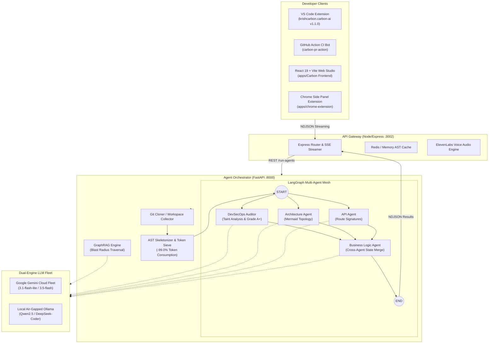

<div align="center">

# 🛡️ CARBON AI — Multi-Agent DevSecOps & Codebase Intelligence Platform

### *Catch leaked secrets and OWASP vulnerabilities before you ship — with automated architecture maps, blast-radius GraphRAG, and an offline local AI mode.*

[](apps/Carbon%20Agent%20Service/tools/security_scanner.py)
[](benchmarks/token_reduction_bench.py)
[](apps/vscode-extension/)
[](.github/workflows/carbon-pr-review.yml)
[](apps/Carbon%20Agent%20Service/agents/graph.py)
[](apps/Carbon%20Agent%20Service/tools/llm_client.py)
[](LICENSE)

---

[DevSecOps Hero](#devsecops-scanner) • [Dogfood Audit](#dogfood-audit) • [Token Benchmark](#token-optimization) • [System Architecture](#system-architecture) • [Full Capabilities](#full-capabilities) • [GitHub Action CI](#github-action) • [VS Code Extension](#vscode-extension) • [Quickstart](#quickstart)

---

</div>

<a id="devsecops-scanner"></a>
## 🛡️ Hero Capability: Static DevSecOps Scanner & Security Scorecard

Most codebase tools tell you what code *does*. **Carbon stops what code *leaks* before it merges into production.**

Every repository scan executes automated static taint analysis, credential entropy checks, and OWASP rule evaluators to generate an actionable **DevSecOps Security Scorecard (A+ to F)** with 1-click unified remediation diffs.

```
┌────────────────────────────────────────────────────────────────────────────┐
│  🛡️ CARBON DEVSECOPS SECURITY SCORECARD                                   │
├──────────────────┬──────────────────┬──────────────────┬───────────────────┤
│  GRADE: A+       │  CRITICAL: 0     │  HIGH: 0         │  TOTAL SCANNED:   │
│  Zero Flaws      │  Secrets Clean   │  OWASP Compliant │  124 Files        │
└──────────────────┴──────────────────┴──────────────────┴───────────────────┘
```

### What Carbon Scans on Every Run:
- 🔑 **Cloud Credential & Secret Detection**: Flags hardcoded AWS keys (`AKIA...`), JWT secrets, MongoDB/PostgreSQL connection URIs with embedded passwords, Stripe/PayPal private keys, and API tokens.
- 💉 **OWASP Top 10 Taint Analysis**: Catches unsanitized SQL/NoSQL query interpolation, dangerous dynamic code execution (`eval()`, `Function()`), wildcard CORS policies (`origin: '*'`), and unhashed password writes.
- 💡 **Actionable Unified Remediation Diffs**: Instead of just flagging a line, Carbon automatically creates drop-in replacement diffs substituting hardcoded secrets with `process.env` references or parameterized queries.

---

<a id="dogfood-audit"></a>
## 🧪 Carbon, Scanned by Carbon (Dogfooding Results)

To verify the rigor of our scanner, we run Carbon's DevSecOps engine against the **Carbon repository itself** on every release using [`benchmarks/dogfood_security_scan.py`](benchmarks/dogfood_security_scan.py).

```bash
python benchmarks/dogfood_security_scan.py
```

### Real Measured Dogfood Audit Output:

| Security Metric | Value | Status |
| :--- | :--- | :--- |
| **Overall Security Grade** | **`A+`** | ✅ Excellent Security Posture |
| **Total Source Files Scanned** | **`124 files`** | 100% of tracked codebase |
| **Critical Findings (Secret Leaks)** | **`0`** | ✅ Zero hardcoded credentials |
| **High Severity (OWASP Taint / SQLi)** | **`0`** | ✅ Zero dangerous dynamic execution |
| **Medium / Low Concerns** | **`0`** | ✅ Clean configuration |

*(Note: Live keys and environment tokens are strictly confined to server-side `.env` files and never checked into source control or distributed in client extension bundles.)*

---

<a id="token-optimization"></a>
## ⚡ AST Token Sieve & Reduction Benchmark

Feeding entire 100,000+ LOC repositories into LLM context windows causes context overflow, severe hallucinations, and prohibitive token bills.

Carbon implements a **Deterministic AST Sieve and Code Skeletonizer** ([`apps/Carbon Agent Service/tools/ast_skeletonizer.py`](apps/Carbon%20Agent%20Service/tools/ast_skeletonizer.py)) that strips deep loop bodies and procedural noise while preserving 100% of classes, interfaces, route signatures, and database schemas.

### 📊 Real Measured Benchmark Results:

The numbers below were **measured by executing [`benchmarks/token_reduction_bench.py`](benchmarks/token_reduction_bench.py)** against the real Carbon repository:

| Benchmark Metric | Raw Codebase | With Carbon AST Skeletonizer | Measured Improvement |
| :--- | :--- | :--- | :--- |
| **Source Files Processed** | 197 files | 56 prioritized architectural files | **Targeted Sieve** |
| **Total Token Consumption** | `1,153,159 tokens` | **`11,038 tokens`** | **🚀 -99.0% Token Reduction** |
| **Payload Size** | `4,515.69 KB` | **`44.32 KB`** | **📦 -99.0% Compression** |
| **AST Extraction Latency** | — | **`39.78 ms`** | **⚡ 4,952 files / sec** |
| **Architectural Signature Fidelity** | 100% | **100%** | **Identical Topology** |

> 🔗 **Reproduce it yourself:** Run `python benchmarks/token_reduction_bench.py` to independently benchmark any repository.

---

<a id="system-architecture"></a>
## 🏗️ System Architecture



---

<a id="full-capabilities"></a>
## ✨ Full Platform Capabilities

Beyond the DevSecOps scanner, Carbon integrates a complete codebase intelligence suite:

<table>
  <tr>
    <td width="50%">
      <h3>🤖 LangGraph Multi-Agent Mesh</h3>
      <p>A distributed state-machine executing specialized agents in parallel: <b>Security Auditor</b>, <b>Architecture Mapper</b>, <b>API Signature Agent</b>, and <b>Business Logic Synthesizer</b>.</p>
    </td>
    <td width="50%">
      <h3>🔒 Air-Gapped Local LLM Mode (Ollama)</h3>
      <p>Run 100% private, offline security audits and architecture analysis using <code>Qwen 2.5-Coder</code> or <code>DeepSeek-Coder</code> with <b>zero internet connectivity</b> and $0 token cost.</p>
    </td>
  </tr>
  <tr>
    <td width="50%">
      <h3>🧠 GraphRAG Impact Q&A & Blast Radius</h3>
      <p>In-memory dependency graph tracking route-to-model call chains. Ask <i>"If I rename User schema, what routes break?"</i> and get citation-backed blast radius maps.</p>
    </td>
    <td width="50%">
      <h3>🎙️ Native Cinema & Studio AI Narration</h3>
      <p>Compiles repository mental models into interactive slide decks with synchronized <b>ElevenLabs studio voice narration</b> and timeline chapters.</p>
    </td>
  </tr>
</table>

---

<a id="github-action"></a>
## 🤖 Automated GitHub Action PR Reviewer

Guard your main branch against architecture drift and secret leaks on every pull request.

<p align="center">
  
</p>

### Add to your repo in 3 lines:
Create `.github/workflows/carbon-pr-review.yml`:
```yaml
name: Carbon PR Reviewer
on:
  pull_request:
    types: [opened, synchronize, reopened]

jobs:
  carbon-review:
    runs-on: ubuntu-latest
    permissions:
      contents: read
      pull-requests: write
    steps:
      - uses: actions/checkout@v4
      - uses: krishna-chhabra-cse/Carbon/apps/carbon-pr-action@main
        with:
          github_token: ${{ secrets.GITHUB_TOKEN }}
          gemini_api_key: ${{ secrets.GEMINI_API_KEY }}
```

---

<a id="vscode-extension"></a>
## 🔌 VS Code Extension (v1.1.0)

Install `carbon-ai-1.1.0.vsix` directly into VS Code or Cursor for local workspace intelligence:

<p align="center">
  
</p>

### Features in Extension:
- ⚡ **Bidirectional Click-to-Code**: Click any node in the interactive Mermaid diagram to jump directly to that source file and line in your editor.
- 🛡️ **Embedded Security Scorecard**: Color-coded security grade with direct links to flagged lines.
- 🧠 **GraphRAG Q&A Console**: Embedded chat assistant answering architectural questions about your local workspace.
- 🎙️ **In-Editor Cinema Walkthrough**: Audio-visual walkthrough of your project without leaving the IDE.

---

<a id="quickstart"></a>
## 🚀 Quickstart

### Option 1: Docker Compose (Recommended)
```bash
git clone https://github.com/krishna-chhabra-cse/Carbon.git
cd Carbon

# Copy environment variables
cp .env.example .env

# Launch Backend, Python Agent Service & Web App
docker compose up --build
```

### Option 2: Local Development Setup

#### 1. Python Agent Service (FastAPI & LangGraph)
```bash
cd "apps/Carbon Agent Service"
pip install -r requirements.txt
python -m uvicorn main:app --reload --port 8000
```

#### 2. Backend Gateway (Node / Express)
```bash
cd "apps/Carbon Backend"
npm install
npm run dev
```

#### 3. Frontend Web Studio (React 19 + Vite)
```bash
cd "apps/Carbon Frontend"
npm install
npm run dev
```

#### 4. VS Code Extension
```bash
cd "apps/vscode-extension"
npm install
npm run compile
npx @vscode/vsce package --no-dependencies
```

---

<a id="automated-tests"></a>
## 🧪 Automated Test & Benchmark Suites

```bash
# 1. DevSecOps Dogfood Security Audit
python benchmarks/dogfood_security_scan.py

# 2. AST Token Sieve & Reduction Benchmark
python benchmarks/token_reduction_bench.py

# 3. DevSecOps Unit Tests & Vulnerability Detection
python "apps/Carbon Agent Service/test_security_scanner.py"

# 4. Air-Gapped Offline Ollama Multi-Model Engine
python "apps/Carbon Agent Service/test_ollama_mode.py"

# 5. GraphRAG Knowledge Graph & Blast Radius Traversal
python "apps/Carbon Agent Service/test_graphrag_chat.py"
```

---

<a id="repository-structure"></a>
## 📂 Repository Structure

```
Carbon/
├── .github/workflows/           # GitHub Actions CI Review Workflows
├── apps/
│   ├── Carbon Agent Service/    # FastAPI + LangGraph Multi-Agent Orchestrator
│   │   ├── agents/              # Architecture, API, Security, BizLogic, GraphRAG
│   │   ├── tools/               # AST Skeletonizer, Taint Scanner, Ollama/Gemini LLM
│   │   └── main.py              # NDJSON Streaming Agent API
│   ├── Carbon Backend/          # Node.js/Express API Gateway, Cache & Voice Engine
│   ├── Carbon Frontend/         # React 19 + Vite Interactive Web Studio & Cinema
│   ├── carbon-pr-action/        # Zero-install GitHub Action PR Review Bot
│   ├── chrome-extension/        # Chrome Manifest V3 Side Panel Companion
│   └── vscode-extension/        # VS Code Extension (TypeScript + Webview)
├── benchmarks/                  # Standalone Token Reduction & Dogfood Audit Benchmarks
├── docs/assets/                 # Architecture diagrams, banners, and screenshots
├── LICENSE                      # MIT License (Krishna Chhabra 2026)
└── docker-compose.yml           # Full-stack container orchestration
```

---

<a id="license"></a>
## 📄 License

Distributed under the **MIT License**. See [`LICENSE`](LICENSE) for more information.

<div align="center">
  <sub>Built with ❤️ by <b>Krishna Chhabra</b> for senior-level engineering & DevSecOps codebase intelligence.</sub>
</div>
