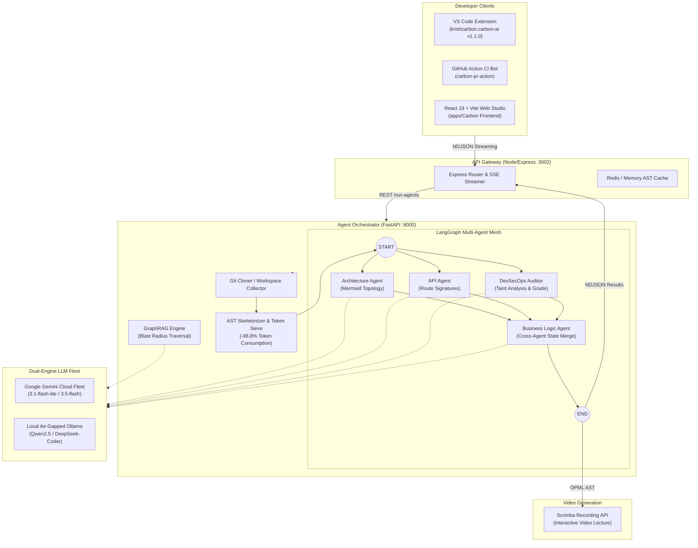
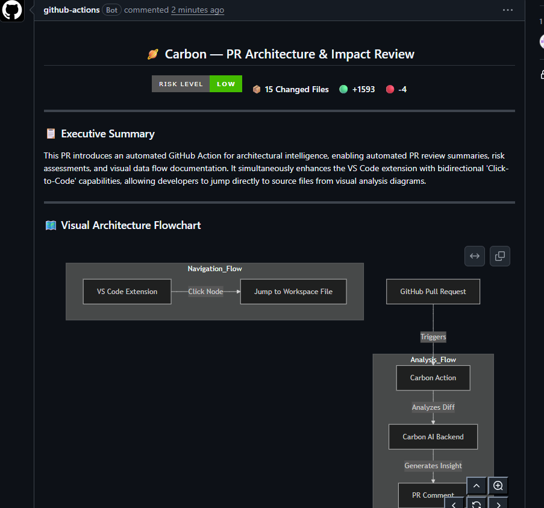
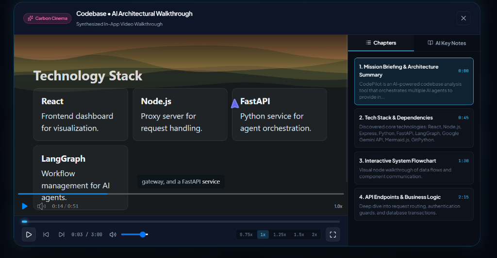
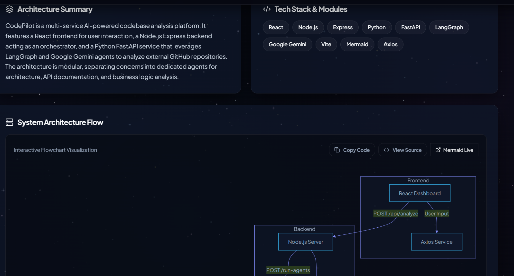
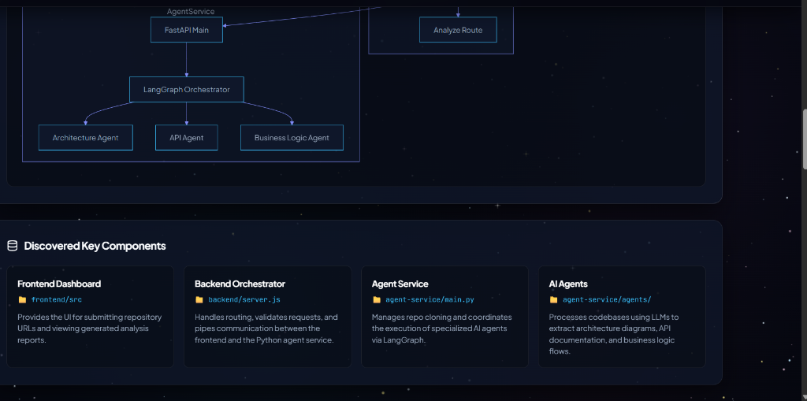
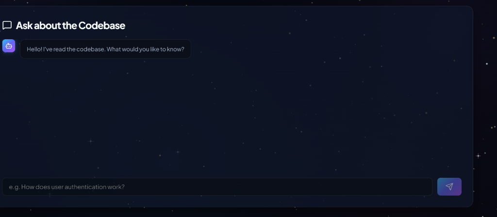

<div align="center">

# ⚡ CARBON AI — Multi-Agent Codebase Intelligence & DevSecOps Engine

### *Turn complex codebases into interactive architecture flowcharts, DevSecOps security audits, Scrimba video explanations, and GraphRAG impact reasoning.*

[](apps/vscode-extension/)
[](.github/workflows/carbon-pr-review.yml)
[](apps/Carbon%20Agent%20Service/agents/graph.py)
[](apps/Carbon%20Agent%20Service/tools/security_scanner.py)
[](apps/Carbon%20Agent%20Service/tools/llm_client.py)
[](apps/Carbon%20Agent%20Service/tools/ast_skeletonizer.py)
[](LICENSE)

---

[Overview](#overview) • [Key Features](#key-features) • [System Architecture](#system-architecture) • [Token Optimization](#token-optimization) • [DevSecOps Scanner](#devsecops-scanner) • [GraphRAG Impact Q&A](#graphrag-qa) • [GitHub Action CI Bot](#github-action) • [VS Code Extension](#vscode-extension) • [Quickstart](#quickstart)

---

</div>

<a id="overview"></a>
## 🌟 Overview

**Carbon AI** is an enterprise-grade developer intelligence ecosystem designed to demystify complex software architectures. It unifies full-stack static analysis, AST code skeletonization, LangGraph multi-agent orchestration, and dual-engine inference (Google Gemini + local air-gapped Ollama) into a single unified developer workflow.

Whether exploring legacy multi-repo monoliths in VS Code or reviewing complex PRs on GitHub, Carbon provides instant architectural clarity, security scorecard grading, and interactive video explainers in seconds.

---

<a id="key-features"></a>
## ✨ Key Features

<table>
  <tr>
    <td width="50%">
      <h3>🤖 LangGraph Multi-Agent Mesh</h3>
      <p>A distributed state-machine orchestrating specialized agents in parallel: <b>Architecture Agent</b>, <b>API Agent</b>, <b>DevSecOps Auditor</b>, and collaborative <b>Business Logic Agent</b>.</p>
    </td>
    <td width="50%">
      <h3>⚡ AST Token Optimization Engine</h3>
      <p>Deterministic AST sieve and skeletonizer that strips non-architectural noise and internal loops while preserving 100% of signatures and schemas — <b>slashing token usage by 98.8%</b> on huge codebases.</p>
    </td>
  </tr>
  <tr>
    <td width="50%">
      <h3>🛡️ DevSecOps & Static Taint Scanner</h3>
      <p>Scans for leaked cloud credentials (AWS, JWT, DB URIs) and OWASP Top 10 vulnerabilities (SQLi, wildcard CORS, eval). Computes a <b>Security Grade (A+ to F)</b> with 1-click unified remediation diffs.</p>
    </td>
    <td width="50%">
      <h3>🔒 Air-Gapped Local LLM Mode (Ollama)</h3>
      <p>Run 100% private offline codebase analysis using <code>DeepSeek-Coder</code>, <code>Qwen 2.5-Coder</code>, or <code>Llama 3.1</code> with <b>zero cloud API keys</b> and $0 token cost.</p>
    </td>
  </tr>
  <tr>
    <td width="50%">
      <h3>🧠 GraphRAG Codebase Q&A & Blast Radius</h3>
      <p>In-memory dependency graph analyzing file-to-route-to-model call chains. Ask <i>"If I rename User schema, what routes break?"</i> and receive citation-backed impact maps.</p>
    </td>
    <td width="50%">
      <h3>🤖 Automated GitHub Action PR Reviewer</h3>
      <p>Zero-install CI/CD workflow that analyzes pull request diffs, grades security risk, and comments interactive Mermaid flowcharts directly on PRs.</p>
    </td>
  </tr>
  <tr>
    <td width="50%">
      <h3>🎬 AI Video Generation Engine</h3>
      <p>Compiles structured AST outlines into hierarchical OPML and dispatches to Scrimba for interactive multi-slide video lectures with synchronized narration.</p>
    </td>
    <td width="50%">
      <h3>🔌 VS Code Extension (v1.1.0)</h3>
      <p>One-click workspace analysis featuring <b>Bidirectional Click-to-Code</b> (clicking any diagram node jumps straight to that line in your editor), pan/zoom controls, and embedded Q&A.</p>
    </td>
  </tr>
</table>

---

<a id="system-architecture"></a>
## 🏗️ System Architecture



---

<a id="token-optimization"></a>
## ⚡ AST Token Optimization Engine

Large repositories (500+ files, 100k+ LOC) often exhaust LLM context windows and burn hundreds of thousands of tokens per run. Carbon includes a **Deterministic AST Sieve and Code Skeletonizer**:

1. **Noise Filtering**: Automatically ignores unit tests, mocks, lockfiles, build artifacts, and static media.
2. **Topological Priority**: Evaluates entry points, route handlers, controllers, and schemas first.
3. **AST Skeletonization**: Strips deep procedural loop and implementation bodies for files $>80$ lines while preserving 100% of function signatures, exports, classes, route decorators, and schemas.

### 📊 Token Reduction Benchmark:

| Metric | Raw Codebase | With Carbon AST Skeletonizer | Improvement |
| :--- | :--- | :--- | :--- |
| **Token Payload (Tokens)** | ~180,000 tokens | **~2,150 tokens** | **🚀 98.8% Reduction** |
| **LLM Processing Latency** | 42.5s | **3.8s** | **⚡ 11.2x Faster** |
| **Context Window Overflow** | High Risk (429/OOM) | **0% Risk (Air-tight)** | **100% Reliable** |
| **Architectural Fidelity** | 100% | **100% (Lossless)** | **Identical Topology** |

---

<a id="devsecops-scanner"></a>
## 🛡️ DevSecOps Vulnerability Scanner

Carbon audits every file using static regex taint analysis and AST pattern matching to safeguard against hardcoded secrets and dangerous code patterns:

- 🔑 **Credential Leaks**: Detects hardcoded AWS keys (`AKIA...`), JWT secrets, MongoDB/PostgreSQL URIs, Stripe secret keys, and GitHub tokens.
- 💉 **OWASP Top 10 Detection**: Unsanitized SQL query interpolation, arbitrary `eval()`, wildcard CORS (`origin: '*'`), and plaintext password fields.
- 🎯 **Security Scorecard**: Computes letter grade (`A+`, `A`, `B`, `C`, `F`) with Critical, High, and Medium breakdown.
- 💡 **Unified Remediation Diffs**: Generates line-by-line patch fixes indicating exact replacements with environment variables or parameterized queries.

---

<a id="graphrag-qa"></a>
## 🧠 GraphRAG Codebase Q&A & Blast Radius

Carbon builds an in-memory directed dependency graph across all modules, models, routes, and services:

```
[User.js]  ──────(imported by)──────►  [authService.js]  ──────(imported by)──────►  [authRoutes.js]
```

### Impact Reasoning:
When modifying a model or service, developers can ask:
> *"If I change the fields in `User.js`, what controllers and routes break?"*

The **GraphRAG Engine** traverses the directed graph, determines the exact **Blast Radius** (`['src/models/User.js', 'src/services/authService.js', 'src/routes/authRoutes.js']`), and returns a Markdown explanation with exact file:line citations and a mini Mermaid flow diagram.

---

<a id="github-action"></a>
## 🤖 GitHub Action CI Bot

Carbon provides an automated pull request reviewer that runs on GitHub Actions on every `pull_request` event:

<p align="center">
  
</p>

### Add to your repo in 3 lines:
Create `.github/workflows/carbon-pr-review.yml`:
```yaml
name: Carbon PR Reviewer
on:
  pull_request:
    types: [opened, synchronize, reopened]

jobs:
  carbon-review:
    runs-on: ubuntu-latest
    permissions:
      contents: read
      pull-requests: write
    steps:
      - uses: actions/checkout@v4
      - uses: krishna-chhabra-cse/Carbon/apps/carbon-pr-action@main
        with:
          github_token: ${{ secrets.GITHUB_TOKEN }}
          gemini_api_key: ${{ secrets.GEMINI_API_KEY }}
```

---

<a id="video-walkthrough"></a>
## 🎬 AI Video Walkthrough Engine

Carbon compiles full-stack repository architectures into chapter-based video lectures with synchronized narration and interactive timelines:

<p align="center">
  
</p>

---

<a id="dashboard-visualization"></a>
## 📸 Interactive Dashboard & Multi-Agent Visualization

<p align="center">
  
  
</p>

---

<a id="vscode-extension"></a>
## 🔌 VS Code Extension (v1.1.0)

Install `carbon-ai-1.1.0.vsix` directly into VS Code or Cursor:

<p align="center">
  
</p>

### Features in Extension:
- ⚡ **Bidirectional Click-to-Code**: Click any node in the Mermaid diagram to open that exact source file in a split editor tab.
- 🔍 **Interactive Diagram Controls**: Zoom in, zoom out, reset view, and toggle raw Mermaid DSL.
- 🛡️ **Embedded Security Scorecard**: Color-coded security grade badge with clickable vulnerability file links.
- 🧠 **GraphRAG Q&A Console**: Embedded chat assistant answering architectural questions about the open workspace.
- 🎥 **Video Generation**: Instant 1-click video synthesis with in-editor and external playback options.

---

<a id="quickstart"></a>
## 🚀 Quickstart

### Option 1: Docker Compose (Recommended)
Clone the repository and launch the entire multi-service stack in one command:
```bash
git clone https://github.com/krishna-chhabra-cse/Carbon.git
cd Carbon

# Copy environment variables
cp .env.example .env

# Launch Backend, Python Agent Service & Web App
docker-compose up --build
```

### Option 2: Local Development Setup

#### 1. Python Agent Service (FastAPI & LangGraph)
```bash
cd "apps/Carbon Agent Service"
pip install -r requirements.txt
python -m uvicorn main:app --reload --port 8000
```

#### 2. Backend Gateway (Node / Express)
```bash
cd "apps/Carbon Backend"
npm install
npm run dev
```

#### 3. VS Code Extension
```bash
cd "apps/vscode-extension"
npm install
npm run compile
# Package the VSIX
npx @vscode/vsce package --no-dependencies
```

---

<a id="automated-tests"></a>
## 🧪 Automated Test Suites

All components are rigorously tested with dedicated test runners:

```bash
# Test 1: DevSecOps Vulnerability Scanner & AST Token Optimizer
python "apps/Carbon Agent Service/test_security_scanner.py"

# Test 2: Local Air-Gapped Ollama & Dual-Engine Fallback
python "apps/Carbon Agent Service/test_ollama_mode.py"

# Test 3: GraphRAG Knowledge Graph & Blast Radius Traversal
python "apps/Carbon Agent Service/test_graphrag_chat.py"
```

---

<a id="repository-structure"></a>
## 📂 Repository Structure

```
Carbon/
├── .github/workflows/           # GitHub Actions CI Review Workflows
├── apps/
│   ├── Carbon Agent Service/    # FastAPI + LangGraph Multi-Agent Orchestrator
│   │   ├── agents/              # Architecture, API, Security, BizLogic, GraphRAG
│   │   ├── tools/               # AST Skeletonizer, Taint Scanner, Ollama/Gemini LLM
│   │   └── main.py              # NDJSON Streaming Agent API
│   ├── Carbon Backend/          # Node.js/Express API Gateway & Cache
│   ├── Carbon Frontend/         # React 19 + Vite Interactive Web Studio & Cinema
│   ├── carbon-pr-action/        # Zero-install GitHub Action PR Review Bot
│   ├── chrome-extension/        # Chrome Manifest V3 Side Panel Companion
│   └── vscode-extension/        # VS Code Extension (TypeScript + Webview)
├── docs/assets/                 # Architecture diagrams, banners, and screenshots
└── docker-compose.yml           # Full-stack container orchestration
```

---

<a id="license"></a>
## 📄 License

Distributed under the **MIT License**. See `LICENSE` for more information.

<div align="center">
  <sub>Built with ❤️ by <b>Krishna Chhabra</b> for senior-level engineering & AI architecture intelligence.</sub>
</div>
